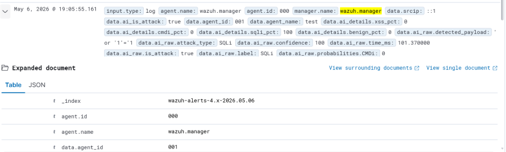

# Wazuh-AI

Wazuh-AI tích hợp mô hình Deep Learning vào hệ thống SIEM để phát hiện tấn công Web (XSS, SQLi, CMDi) với độ chính xác cao, tự động hóa quy trình phân tích log thủ công.

## Kết quả đạt được

1. Tự động hóa hoàn toàn: Quét và phân tích 100% log web theo thời gian thực.
2. Độ chính xác cao: Sử dụng kiến trúc CNN + Residual Blocks để nhận diện các kỹ thuật bypass WAF phức tạp.
3. Giảm nhiễu (False Positive): Tích hợp bộ lọc bóc tách payload thông minh, loại bỏ dữ liệu rác từ Cookie và JWT.
4. Cảnh báo theo độ tin cậy: Phân loại mức độ nguy hiểm dựa trên xác suất (confidence) của AI.
5. Triển khai nhanh: Đóng gói sẵn trong Docker, vận hành ngay sau 3 bước.
6. Khả năng mở rộng: Dễ dàng cập nhật thêm các loại tấn công mới chỉ bằng cách cập nhật mô hình AI (model), không cần thay đổi cấu trúc hệ thống.

## Thành phần chính

- Wazuh Stack: Thu thập log, quản lý cảnh báo và hiển thị Dashboard.
- AI Detection Service: API (FastAPI + PyTorch) phân tích payload bằng Deep Learning.
- Custom Bridge: Script trích xuất dữ liệu và gửi sang AI theo thời gian thực.

## Hướng dẫn cài đặt

- Yêu cầu: Docker & Docker Compose. RAM tối thiểu 4GB (Khuyến nghị 8GB).

### Các bước triển khai

1. Clone dự án:
git clone https://github.com/Theghost6/Wazuh-AI.git
cd Wazuh-AI/single-node

2. Tạo chứng chỉ SSL:
docker-compose -f generate-indexer-certs.yml run --rm generator

3. Khởi động:
docker-compose up --build -d

### Truy cập Dashboard

- URL: https://localhost:443
- User/Pass: admin / SecretPassword

## Minh chứng kết quả

### Chi tiết cảnh báo AI
Thông tin chi tiết về payload bị phát hiện kèm độ tin cậy (%) từ mô hình AI.

## Cách thức hoạt động

1. Wazuh Agent thu thập log truy cập web.
2. Script `custom-ai` trích xuất URL và POST Body.
3. Gửi payload sang AI Detection Service để phân loại.
4. Nhận kết quả dự đoán và mức độ tin cậy.
5. Kích hoạt cảnh báo Level 14 (Critical) trên Dashboard nếu phát hiện tấn công.

